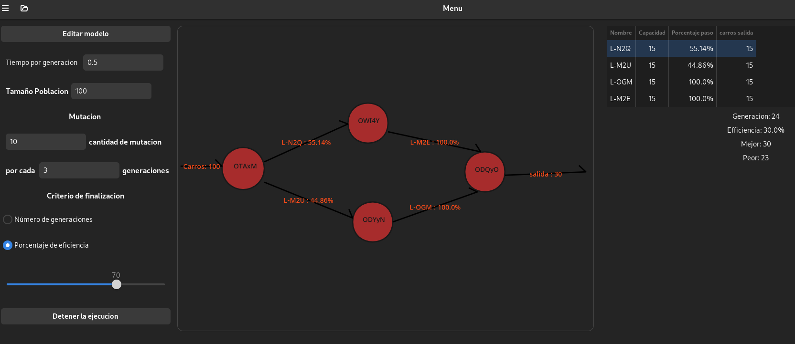
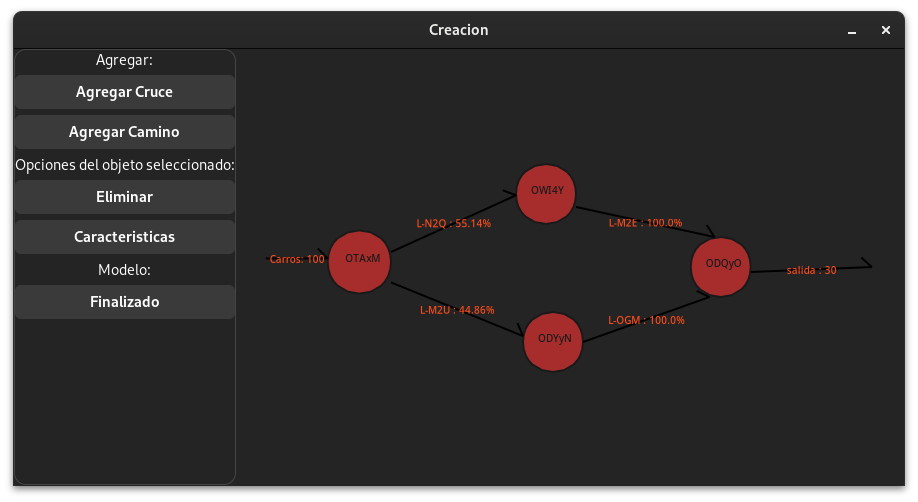
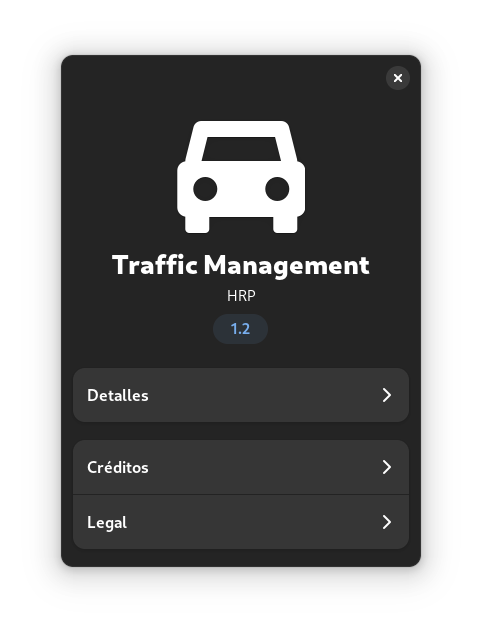

# Traffic System

El **Traffic System** es un algoritmo genético implementado en Python, que utiliza las bibliotecas GTK y Gaphas para simular sistemas de tráfico. Este sistema se encarga de optimizar el flujo vehicular mediante la simulación y análisis de diferentes estrategias de control de tráfico.

## Funcionamiento

El algoritmo genético desarrollado en Python utiliza la biblioteca GTK para la interfaz gráfica y la visualización de resultados, así como la biblioteca Gaphas para la representación de gráficos. Se han utilizado las siguientes versiones de las bibliotecas:

- GTK: 4.0.0
- Gaphas: 4.0.0
- Pycairo: 1.26.0
- PyGObject: 3.48.2

Estas dependencias están especificadas en el archivo `requirements.txt`.

Para ejecutar el programa, se recomienda crear un entorno virtual. A continuación, se detallan los pasos para la instalación de las dependencias en un entorno Fedora 39:

```bash
sudo dnf install -y python3-dev python3-gi python3-gi-cairo
sudo dnf install python3-devel python3-gi python3-cairo gir1.2-gtk3 libgirepository-devel libcairo2-devel
sudo dnf install -y python3-devel pygobject3 python3-cairo-devel gtk3-devel gobject-introspection-devel cairo-devel
```

para un entorno basado en debian, como lo es Ubunto, Kubuntu, Linux Mint, etc aqui estan las dependencias:

```bash
sudo apt-get install -y python3-dev python3-gi python3-gi-cairo gir1.2-gtk-3.0 libgirepository1.0-dev libcairo2-dev
```

Es importante tener instalado GTK para el correcto funcionamiento del programa. Se requiere la versión 4 de GTK y la versión 1 de ADW. Esto se especifica en el código utilizando las siguientes líneas:

```python
gi.require_version('Gtk', '4.0')
gi.require_version('Adw', '1')
from gi.repository import Gtk, Adw, Gdk, GLib, Gio
```

## Instalación

Para instalar las dependencias necesarias, se puede utilizar el archivo `requirements.txt` y crear un entorno virtual con las siguientes instrucciones:

1. Clonar el repositorio desde GitHub: `git clone https://github.com/Chejohrpp/IA-2024-PR1-AG-TRAFFIC-SYSTEM`
2. Crear un entorno virtual: `python3 -m venv venv`
3. Activar el entorno virtual: `source venv/bin/activate`
4. Instalar las dependencias: `pip install -r requirements.txt`

## Uso

Una vez instaladas las dependencias y configurado el entorno virtual, se puede ejecutar el programa utilizando el archivo `main.py`. Este archivo se encuentra en la raíz del repositorio. 

Para ejecutar el programa, utiliza el siguiente comando:

```bash
python main.py
```


## Inicio

Si todo se ha configurado correctamente, al iniciar el programa se presentará el menú de ajustes y vista previa:




### Configuración del algoritmo genético
El menú de inicio consta de tres apartados para configurar los parámetros del algoritmo genético:

1. **Tiempo entre generaciones:** Se puede ingresar el tiempo que tarda cada generación en completarse en segundos.
2. **Tamaño de la población:** Determina el tamaño de la población, que debe ser par ya que por cada dos padres se generan dos hijos.
3. **Mutación:** Define la cantidad de mutaciones por cada Y generaciones.
4. **Criterio de finalización:** Puede ser por cantidad de generaciones o por un porcentaje de eficiencia basado del 0 al 100.
5. **Botón de ejecución/detención:** Permite iniciar o detener el algoritmo.

### Vista del modelo
En esta sección se muestra el modelo de tráfico creado por el usuario, que incluye cruces y caminos.

### Apartado de estadísticas
Muestra información actualizada por cada generación, incluyendo:
- Los caminos entre cruces (sin entradas ni salidas)
- La generación actual
- El mejor y peor valor de fitness
- El porcentaje de eficiencia

### Barra de encabezado
Permite ejecutar el algoritmo, guardar y abrir modelos, así como acceder a la información sobre la aplicación.

## Editar el modelo
Al hacer clic en el botón para crear el modelo, se abrirá una nueva ventana donde podrás agregar caminos y cruces, cambiar sus características y eliminar elementos seleccionados.



## Acerca de la aplicación



El diálogo "Acerca de" proporciona información básica sobre la aplicación:

- **Nombre:** Traffic Management
- **Versión:** 1.2
- **Desarrollador:** HRP
- **Comentarios:** Aplicación para gestión de tráfico
- **Sitio web:** [Enlace al repositorio en GitHub](https://github.com/Chejohrpp/IA-2024-PR1-AG-TRAFFIC-SYSTEM)
- **Derechos de autor:** © 2024 HRP

Este diálogo proporciona una visión general de la aplicación y su origen.

Con esta información, ya deberías tener una buena comprensión de cómo usar la aplicación.
